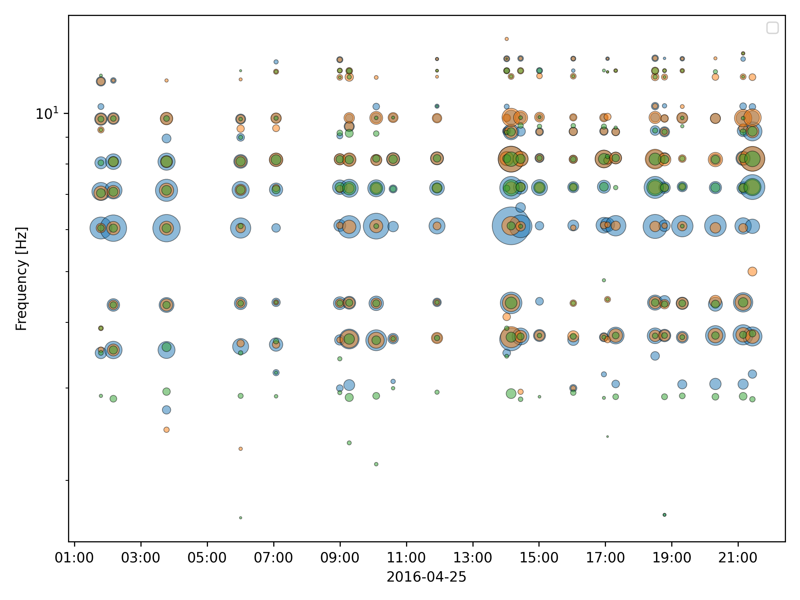

# Demo scripts

This folder contains two minimal working examples just for demonstration purposes.

The first example is intended to demonstrate the core detection and spectral peak extraction.
To run this you won't need to have a PostgreSQL server running.

For those users looking to establish their own database, section 2 demonstrate how to create and pre-populate a database, respectively.

Before anything, copy the configuration file example to your root as a hidden dot file:
```bash
cp ./example/tonus.toml ~/.tonus.toml

```
and make sure you have an active conda environment with the dependencies as shown in the README file of this repository.

## 1. Detecion and processing

In this section we detect and automatically process tonal coda events with many spectral peaks from Turrialba volcano.
For this purpose we have provided `mseed` files in the `wfs/` folder for a day when tens of tonal events occured at this volcano.
This is a two step process, first we detect the events, then we extract the desired data from their waveforms.

### 1.1. Detect events

First, modify this section of the `~/.tonus.toml` file:
```toml
[detect.io]
input_dir = "[PATH/TO/REPO]/example/wfs/"
output_file = "[PATH/TO/REPO]/example/detect_output.csv"
```
so that the program knows where the `mseed` waveform files are and were to output the results, 
and indicate in the `~/.tonus.toml` file where the inventory is (we already provide one in this folder):
```toml
inventory = "[PATH/TO/REPO]/example/inventory.xml"
```
Then, run:
```bash
tonus-detect --starttime 2016-04-25 --endtime 2016-04-26
```
This creates a file `detect_output.csv` in the format of the Swarm software (USGS).
The first column is the start time of the event, the second column is a waveform label, and the third column is the event duration duration.

### 1.2. Process events

Now, with the detections obtained, we can process the data to extract the characteristics of the spectral peaks.
For this demo, in replacement of the GUI, we have prepared a command-line script that automatically process the data and inserts it to the database automatically and plots the results.

```bash
python automatic_processing.py detect_output.csv
```

The final output is a plot like the following, where you can see the frequency of the spectral peaks for three different stations.
The coincidence of the 3 indicates the good quality of the results.



## 2. Database setup

Now, if you are interested in having a database for the storage of your own analysis and run the GUI, you can use the following examples as a guide.

Before running this demo script make sure you have running PostgreSQL service,

### 2.1. Create the database

First modify this section of the `toml` file according to your PostgreSQL installation:

```toml
[db]
host = "your host"
user = "your user"
password = "your password"
database = "tonus_test"
```

Then, run the command-line script that creates the database

```bash
tonus-db
```

This creates the database with the proper SQL schema.

### 2.2. Populate the database

Now, we demonstrate how to populate the database you just created with volcano and stations information.
You'll need a `csv` file for the volcano information and a `STATIONXML` inventory for the instrument responses.

Then run:

```bash
tonus-db-populate volcanoes.csv
```

Now you could run the GUI and process the detections yourself, instead of automatically, which would lead to better results if you tune the parameters according to what you see in the spectrogram.
